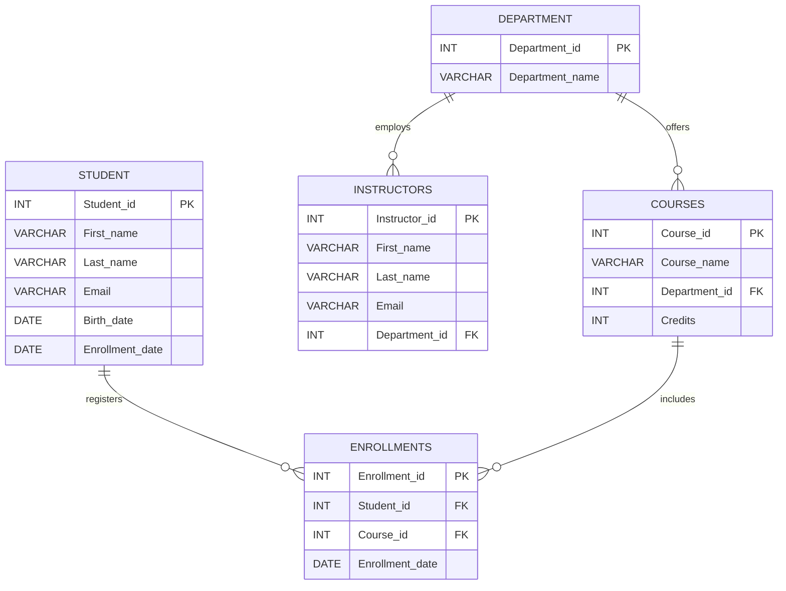

# Final Project University Management System

<div align="center">

# 🎓 UNIVERSITY MANAGEMENT SYSTEM
### `Enterprise Schema Design • Relational Modeling • Academic Data Engine`

**👨‍💻 Created & Maintained by [Dixit Maru](https://github.com/Dixit2307)**

[](https://github.com/Dixit2307)
[](https://www.mysql.com/)
[](#)
[](#)
[](#)


<br/>


</div>

---

## 🧬 System Architecture

**University Management System** is a normalized relational database designed to manage modern academic operations, course registrations, departmental organization, and faculty assignments.

```text
       ┌──────────────┐
       │  DEPARTMENT  │
       └──────┬───────┘
              │ 1:N
      ┌───────┴────────┐
      ▼                ▼
┌───────────┐    ┌─────────────┐
│  COURSES  │    │ INSTRUCTORS │
└─────┬─────┘    └─────────────┘
      │ 1:N
      ▼
┌─────────────┐          ┌───────────┐
│ ENROLLMENTS │◄─────────│  STUDENT  │
└─────────────┘   1:N    └───────────┘
```

The system establishes an academic ecosystem across five foundational entities: **Students, Courses, Instructors, Enrollments, and Departments**.

---

## 🖥️ Entity Data Dictionary

| Table | Entity Name | Primary Key | Role & Architectural Scope |
| :--- | :--- | :--- | :--- |
| 🧑‍🎓 **`Student`** | Student Registry | `Student_id` | Stores student profile data, birth records, and matriculation dates |
| 🏛️ **`Department`** | Department Directory | `Department_id` | Master list of academic divisions and faculties |
| 📚 **`Courses`** | Course Catalog | `Course_id` | Maintains course offerings, credit weights, and parent departments |
| 👨‍🏫 **`Instructors`** | Faculty Master | `Instructor_id` | Faculty member profiles linked to academic departments |
| 📝 **`Enrollments`** | Enrollment Bridge | `Enrollment_id` | Many-to-Many ($M:N$) junction table linking students to courses |

---

## 🧠 Database Relational Blueprint



---

## 🛠️ DDL Schema Implementation

```sql
-- 1. Initialize Academic Core Schema
CREATE DATABASE Univarsity_management_System;
USE Univarsity_management_System;

-- 2. Master Department Directory
CREATE TABLE Department (
    Department_id INT PRIMARY KEY,
    Department_name VARCHAR(50) NOT NULL
);

-- 3. Student Entity Table
CREATE TABLE Student (
    Student_id INT PRIMARY KEY,
    First_name VARCHAR(50) NOT NULL,
    Last_name VARCHAR(50) NOT NULL,
    Email VARCHAR(50) UNIQUE,
    Birth_date DATE,
    Enrollment_date DATE NOT NULL
);

-- 4. Course Curriculum Registry
CREATE TABLE Courses (
    Course_id INT PRIMARY KEY,
    Course_name VARCHAR(50) NOT NULL,
    Department_id INT,
    Credits INT DEFAULT 3,
    FOREIGN KEY (Department_id) REFERENCES Department(Department_id)
);

-- 5. Academic Faculty & Instructors
CREATE TABLE Instructors (
    Instructor_id INT PRIMARY KEY,
    First_name VARCHAR(50) NOT NULL,
    Last_name VARCHAR(50) NOT NULL,
    Email VARCHAR(50) UNIQUE,
    Department_id INT,
    FOREIGN KEY (Department_id) REFERENCES Department(Department_id)
);

-- 6. Many-to-Many Enrollment Junction
CREATE TABLE Enrollments (
    Enrollment_id INT PRIMARY KEY,
    Student_id INT NOT NULL,
    Course_id INT NOT NULL,
    Enrollment_date DATE NOT NULL,
    FOREIGN KEY (Student_id) REFERENCES Student(Student_id),
    FOREIGN KEY (Course_id) REFERENCES Courses(Course_id)
);
```

---

## 📈 SQL Skill Radar

```text
████████████████████  Relational Schema Design
████████████████████  Normalization & Key Assignment
██████████████████░░  Junction Table ($M:N$) Architecture
██████████████████░░  Referential Integrity Enforcement
████████████████░░░░  Domain Data Modeling
```

---

## ⚙️ Tech Stack


---

## 🚀 Execution & Setup

### 01 — Clone the Repository
```bash
git clone https://github.com/Dixit2307/university-management-system.git
cd university-management-system
```

### 02 — Run Schema Migrations
```bash
mysql -u root -p < schema.sql
```

---

## 🧠 NextGen Challenge Mode

```text
[ LEVEL 01 ]  Insert sample cohorts across Computer Science & Engineering
[ LEVEL 02 ]  Write an INNER JOIN query to show full student-course grade sheets
[ LEVEL 03 ]  Implement a composite UNIQUE constraint on (Student_id, Course_id)
[ LEVEL 04 ]  Build a VIEW for Faculty-to-Course allocation workloads
[ LEVEL 05 ]  Add GPA/Grade tracking to the Enrollments junction table
```

---

## 👨‍💻 Developer — Dixit Maru

> **NextGen Developer • Database Engineering • Data Systems**
>
> 🐙 GitHub: **[Dixit2307](https://github.com/Dixit2307)**

---

<div align="center">

### `DATA GROWS KNOWLEDGE.`
### `GOOD SCHEMA DESIGN MAKES IT LAST.`

<br/>


**Built with precision by [Dixit Maru](https://github.com/Dixit2307)**

[⭐ Follow Dixit2307 on GitHub](https://github.com/Dixit2307)

</div>
